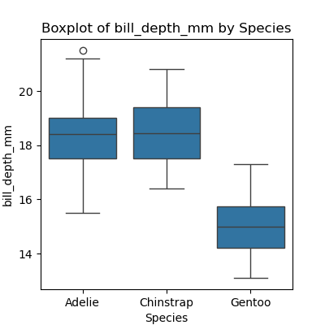
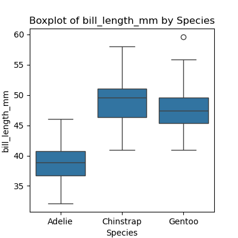
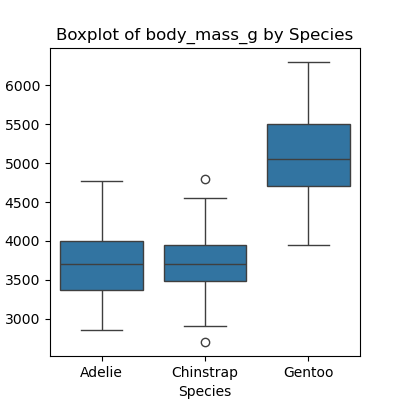
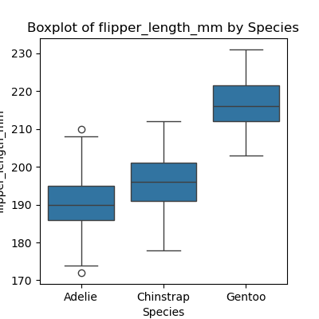

::::::::::::::::::::::::::::::::::::::: objectives

- Be able to read and write globbing expressions that match sets of files.
- Use glob to create lists of files.
- Write for loops to perform operations on files given their names in a list.

::::::::::::::::::::::::::::::::::::::::::::::::::

:::::::::::::::::::::::::::::::::::::::: questions

- How can I process many data sets with a single command?

::::::::::::::::::::::::::::::::::::::::::::::::::

## Use a `for` loop to process files given a list of their names.

- A filename is a character string.
- And lists can contain character strings.

```python
import pandas as pd
for filename in ['data/data-palmers-penguins.csv', 'data/data-breast-cancer.csv']:
    data = pd.read_csv(filename)
    print(filename, data.min())
```

```output
data/data-palmers-penguins.csv species              Adelie
island               Biscoe
bill_length_mm         32.1
bill_depth_mm          13.1
flipper_length_mm     172.0
body_mass_g          2700.0
sex                  Female
dtype: object
data/data-breast-cancer.csv diagnosis                    0.000000
radius_mean                  6.981000
texture_mean                 9.710000
perimeter_mean              43.790000
area_mean                  143.500000
smoothness_mean              0.052630
compactness_mean             0.019380
concavity_mean               0.000000
concave points_mean          0.000000
symmetry_mean                0.106000
fractal_dimension_mean       0.049960
radius_se                    0.111500
texture_se                   0.360200
perimeter_se                 0.757000
area_se                      6.802000
smoothness_se                0.001713
compactness_se               0.002252
concavity_se                 0.000000
concave points_se            0.000000
symmetry_se                  0.007882
fractal_dimension_se         0.000895
radius_worst                 7.930000
texture_worst               12.020000
perimeter_worst             50.410000
area_worst                 185.200000
smoothness_worst             0.071170
compactness_worst            0.027290
concavity_worst              0.000000
concave points_worst         0.000000
symmetry_worst               0.156500
fractal_dimension_worst      0.055040
dtype: float64
```

## Use [`glob.glob`](https://docs.python.org/3/library/glob.html#glob.glob) to find sets of files whose names match a pattern.

- In Unix, the term "globbing" means "matching a set of files with a pattern".
- The most common patterns are:
  - `*` meaning "match zero or more characters"
  - `?` meaning "match exactly one character"
- Python's standard library contains the [`glob`](https://docs.python.org/3/library/glob.html) module to provide pattern matching functionality
- The [`glob`](https://docs.python.org/3/library/glob.html) module contains a function also called `glob` to match file patterns
- E.g., `glob.glob('*.txt')` matches all files in the current directory
  whose names end with `.txt`.
- Result is a (possibly empty) list of character strings.

```python
import glob
print('all csv files in data directory:', glob.glob('data/*.csv'))
```

```output
all csv files in data directory: ['data/data-palmers-penguins.csv', 'data/data-breast-cancer.csv']
```

```python
print('all PDB files:', glob.glob('*.pdb'))
```

```output
all PDB files: []
```

## Use `glob` and `for` to process batches of files.

- Helps a lot if the files are named and stored systematically and consistently
  so that simple patterns will find the right data.

```python
for filename in glob.glob('data/data-*.csv'):
    data = pd.read_csv(filename)
    print(filename, data.min())
```

```output
data/data-palmers-penguins.csv species              Adelie
island               Biscoe
bill_length_mm         32.1
bill_depth_mm          13.1
flipper_length_mm     172.0
body_mass_g          2700.0
sex                  Female
dtype: object
data/data-breast-cancer.csv diagnosis                    0.000000
radius_mean                  6.981000
texture_mean                 9.710000
perimeter_mean              43.790000
area_mean                  143.500000
smoothness_mean              0.052630
compactness_mean             0.019380
concavity_mean               0.000000
concave points_mean          0.000000
symmetry_mean                0.106000
fractal_dimension_mean       0.049960
radius_se                    0.111500
texture_se                   0.360200
perimeter_se                 0.757000
area_se                      6.802000
smoothness_se                0.001713
compactness_se               0.002252
concavity_se                 0.000000
concave points_se            0.000000
symmetry_se                  0.007882
fractal_dimension_se         0.000895
radius_worst                 7.930000
texture_worst               12.020000
perimeter_worst             50.410000
area_worst                 185.200000
smoothness_worst             0.071170
compactness_worst            0.027290
concavity_worst              0.000000
concave points_worst         0.000000
symmetry_worst               0.156500
fractal_dimension_worst      0.055040
dtype: float64
```

- This includes the minimal data point in both `data-palmers-penguins` and `data-vreast-cancer` datasets.
- Use a more specific pattern in the exercises to exclude the whole data set.

:::::::::::::::::::::::::::::::::::::::  challenge

## Determining Matches

Which of these files is *not* matched by the expression `glob.glob('*as*.csv')`?

1. `gapminder_gdp_africa.csv`
2. `gapminder_gdp_americas.csv`
3. `gapminder_gdp_asia.csv`

:::::::::::::::  solution

## Solution

1 is not matched by the glob.


:::::::::::::::::::::::::

::::::::::::::::::::::::::::::::::::::::::::::::::

:::::::::::::::::::::::::::::::::::::::  challenge

## Minimum File Size

Modify this program so that it prints the number of records in
the file that has the fewest records.

```python
import glob
import pandas as pd
fewest = ____
for filename in glob.glob('data/*.csv'):
    dataframe = pd.____(filename)
    fewest = min(____, dataframe.shape[0])
print('smallest file has', fewest, 'records')
```

Note that the [`DataFrame.shape()` method][shape-method]
returns a tuple with the number of rows and columns of the data frame.

:::::::::::::::  solution

## Solution

```python
import glob
import pandas as pd
fewest = float('Inf')
for filename in glob.glob('data/*.csv'):
    dataframe = pd.read_csv(filename)
    fewest = min(fewest, dataframe.shape[0])
print('smallest file has', fewest, 'records')
```

You might have chosen to initialize the `fewest` variable with a number greater than the numbers
you're dealing with, but that could lead to trouble if you reuse the code with bigger numbers.
Python lets you use positive infinity, which will work no matter how big your numbers are.
What other special strings does the [`float` function][float-function] recognize?


:::::::::::::::::::::::::

::::::::::::::::::::::::::::::::::::::::::::::::::

:::::::::::::::::::::::::::::::::::::::  challenge

## Comparing Data
Write a program that plots a boxplot of all numeric features distribution in each species. **Hint:** Generate a list of all the numeric columns first. Use F-string to name each plot and to save the plots at separate files.

:::::::::::::::  solution

## Solution

```python
import pandas as pd
import seaborn as sns
import matplotlib.pyplot as plt

numeric_columns = data_penguins.select_dtypes(include=['number']).columns.tolist()

for col in numeric_columns:
    plt.figure(figsize=(4, 4))
    sns.boxplot(x='species', y=col, data=data_penguins)
    plt.title(f"Boxplot of {col} by Species")
    plt.xlabel('Species')
    plt.ylabel(col)
    plt.show()
```

{}

{}

{}

{}

:::::::::::::::::::::::::

::::::::::::::::::::::::::::::::::::::::::::::::::

:::::::::::::::::::::::::::::::::::::::::  callout

## Dealing with File Paths

The [`pathlib` module][pathlib-module] provides useful abstractions for file and path manipulation like
returning the name of a file without the file extension. This is very useful when looping over files and
directories. In the example below, we create a `Path` object and inspect its attributes.

```python
from pathlib import Path

p = Path("data/data-palmers-penguins.csv")
print(p.parent)
print(p.stem)
print(p.suffix)
```

```output
data
data-palmers-penguins
.csv
```

**Hint:** Check all available attributes and methods on the `Path` object with the `dir()`
function.


::::::::::::::::::::::::::::::::::::::::::::::::::

[shape-method]: https://pandas.pydata.org/pandas-docs/stable/reference/api/pandas.DataFrame.shape.html
[float-function]: https://docs.python.org/3/library/functions.html#float
[split-method]: https://docs.python.org/3/library/stdtypes.html#str.split
[pathlib-module]: https://docs.python.org/3/library/pathlib.html


:::::::::::::::::::::::::::::::::::::::: keypoints

- Use a `for` loop to process files given a list of their names.
- Use `glob.glob` to find sets of files whose names match a pattern.
- Use `glob` and `for` to process batches of files.

::::::::::::::::::::::::::::::::::::::::::::::::::


